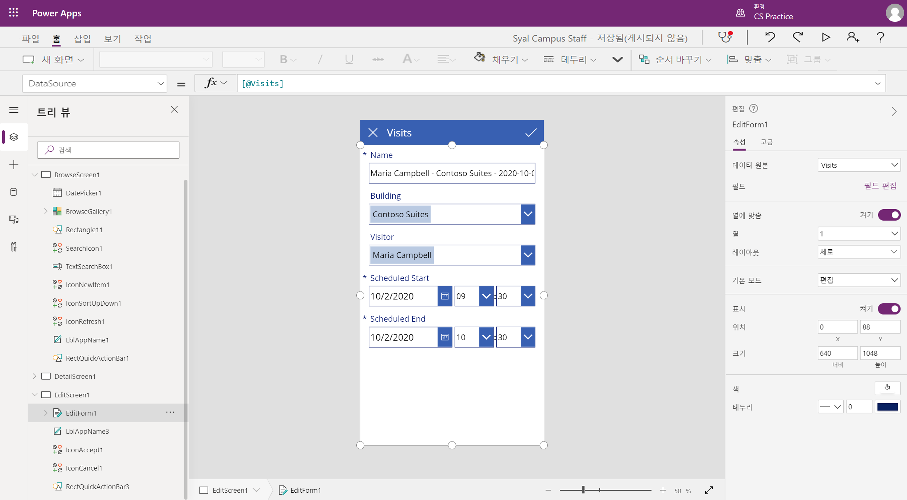
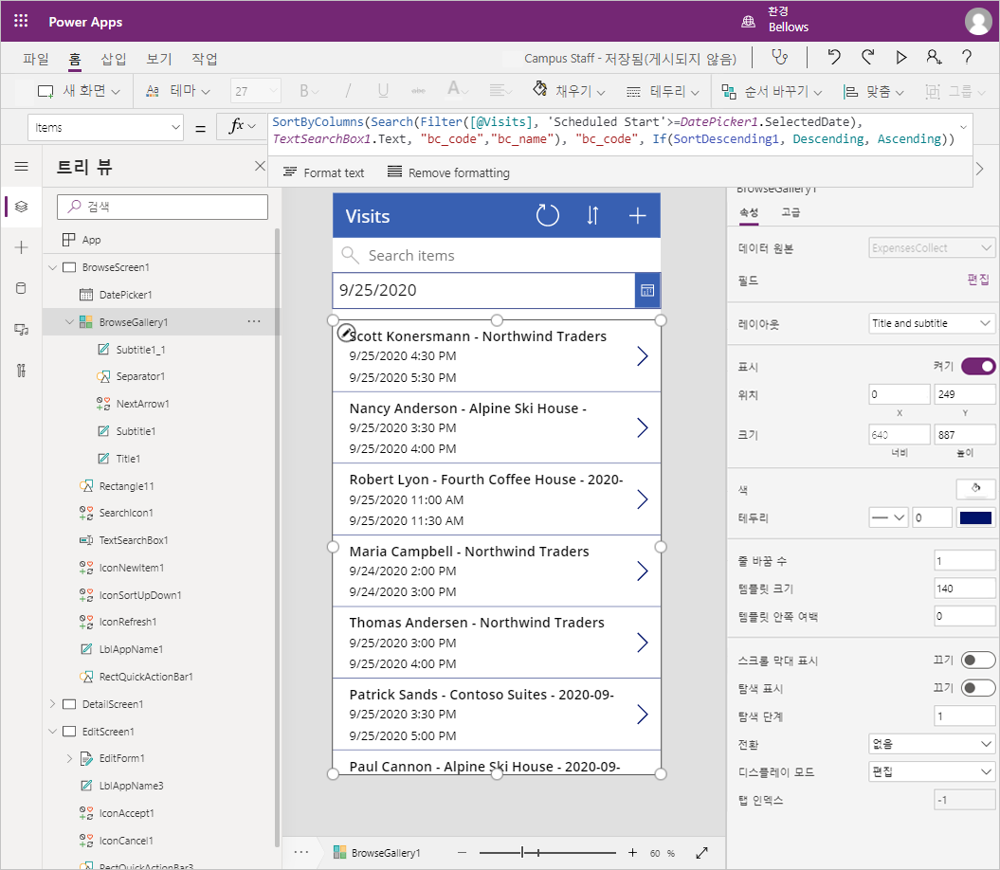

---
lab:
    title: '랩 2: 캔버스 앱을 빌드하는 방법, 1부'
    module: '모듈 3: Power Apps 시작'
---

# 모듈 3: Power Apps 시작

## 랩: 캔버스 앱을 빌드하는 방법, 1부

# 시나리오

Bellows College는 캠퍼스 내에 여러 건물이 있는 교육 기관입니다. 캠퍼스 방문은 현재 종이에 기록되어 있습니다. 이 정보는 일관되게 수집되지 않으며, 전체 캠퍼스 방문 데이터를 수집하고 분석할 방법이 없습니다. 

캠퍼스 관리부는 건물 액세스가 보안 요원에 의해 제어되고, 모든 방문이 반드시 호스트에 의해 사전 등록 및 기록되는 현대화된 방문자 등록 시스템을 원합니다.

이 과정 전반에 걸쳐 벨로즈 칼리지 관리 및 보안 담당자가 캠퍼스 내 건물에 대한 액세스를 관리하고 제어할 수 있도록 애플리케이션을 빌드하고 자동화를 수행합니다.  

이 랩의 1부에서는 대학 직원이 게스트의 방문을 관리하는 데 사용할 수 있는 Power Apps 캔버스 앱을 설계합니다.

# 고급 랩 단계

캔버스 앱을 디자인하기 위해 아래 개요를 따릅니다:

-   휴대폰 폼 팩터 템플릿을 사용하여 데이터에서 앱 만들기
-   방문 정보가 있는 상세 페이지 구성
-   방문에 대해 생성할 편집 페이지 구성
-   방문을 표시하기 위한 갤러리 컨트롤 구성
-   갤러리 데이터 원본에 필터링을 추가하여 향후 방문만 표시합니다.

## 사전 요구 사항

* **모듈 0 랩 0 - 랩 환경 검증** 완료
* **모듈 2 랩 1 - Common Data Service 소개** 완료

## 시작하기 전에 고려해야 할 사항

-   대상 그룹에 대해 가장 널리 사용되는 폼 팩터는 무엇입니까?
-   시스템의 레코드 수를 추정합니다. 
-   앱 성능 및 사용자 채택을 개선하기 위해 선택한 레코드를 좁히는 방법


# 연습 \#1: 직원 캔버스 앱 만들기

**목표:** 이 연습에서는 템플릿에서 캔버스 앱을 만든 다음, 필요한 데이터를 포함하도록 수정합니다.

## 작업 \#1: 캔버스 앱 만들기

이 작업에서는 Common Data Service를 기반으로 휴대폰 레이아웃 템플릿을 사용하여 캔버스 앱을 만듭니다. Common Data Service에서 선택한 엔터티로 방문을 사용하여 템플릿은 갤러리 - 뷰 - 편집 앱을 생성하여 캠퍼스 방문을 관리합니다.

1.  캠퍼스 관리 솔루션을 엽니다.

    -   <https://make.powerapps.com>에 로그인합니다

    -   아직 설정되지 않은 경우 오른쪽 상단에서 **환경**을 선택합니다.
        연습 환경.

    -   **앱**을 선택합니다.

2.  새 캔버스 애플리케이션 만들기

    -   **앱 새로 만들기**를 클릭하고 **캔버스**를 선택합니다.

    -   **Common Data Service**에서 **휴대폰 레이아웃**을 선택합니다.

3.  **Common Data Service** 연결을 선택한 다음, **만들기**를 클릭합니다.

4.  **방문** 테이블을 선택합니다.

5.  **연결**을 클릭합니다.

6.  **Power Apps 스튜디오에 오신 것을 환영합니다** 창이 나타날 수 있습니다. **건너뛰기**를 클릭합니다.

7.  애플리케이션 저장

    -   **파일 \> 저장**을 클릭합니다.

    -   **[성] 캠퍼스 직원**을 **이름**으로 입력합니다.

    -   **저장**을 누릅니다.

## 작업 \#2: 방문 세부 정보 양식 구성

이 작업에서는 개별 방문 기록에 대한 정보를 볼 수 있도록 세부 정보 양식을 구성합니다.

1.  왼쪽 상단의 **뒤로** 화살표를 선택하여 앱 정의로 돌아갑니다.

2. **트리 뷰**에서 **DetailScreen1**을 펼칩니다.

3.  **DetailForm1**을 선택합니다.

4.  오른쪽 패널의 **필드** 옆에 있는 **필드 편집**을 선택합니다.

5.  **필드 추가**를 클릭합니다.

6.  다음 필드를 선택하세요.

    * 실제 종료
    
    * 실제 시작
    
    * 건물 
    
    * 코드
    
    * 예약된 종료
    
    * 예약된 시작
    
    * 방문자
    
7.  **추가**를 클릭합니다.

8.  **필드** 창에서 필드 이름을 위 또는 아래로 끌어서 놓아 필드를 다시 정렬합니다. 권장 순서는 다음과 같습니다.
    * 코드, 이름, 건물, 방문자, 예약된 시작, 예약된 종료, 실제 시작, 실제 종료
    
9.  진행 중인 작업을 저장하려면 **파일**을 클릭한 후 **저장**을 클릭합니다. 뒤로 화살표를 사용하여 앱으로 돌아갑니다.

## 작업 \#3: 방문 편집 양식 구성 

이 작업에서는 개별 방문 레코드에 대한 정보를 편집하도록 양식을 구성합니다.

1.  **트리 뷰**에서 **EditScreen1**을 펼칩니다.

2.  **EditForm1**을 선택합니다.

3.  **생성됨** 필드를 선택하고 **Del** 키를 눌러 필드를 제거합니다.

4.  속성 패널에서 **필드 편집**을 선택합니다.

5.  **필드 추가**를 클릭합니다.

6.  다음 필드를 선택하세요.

    * 건물 
    
    * 예약된 종료
    
    * 예약된 시작
    
    * 방문자
    
7.  **추가**를 클릭합니다.

8.  **필드** 창에서 필드 이름을 위 또는 아래로 끌어서 놓아 필드를 다시 정렬합니다. 권장 순서는 다음과 같습니다.
    
    * 이름, 건물, 방문자, 예약된 시작, 예약된 종료
    
    화면이 다음과 거의 같아야 합니다.



9.  진행 중인 작업을 저장하려면 **파일**을 클릭한 후 **저장**을 클릭합니다. 뒤로 화살표를 사용하여 앱으로 돌아갑니다.

## 작업 \#4: 방문 갤러리 구성

이 작업에서는 방문의 제목, 시작 및 종료 날짜를 표시하도록 미리 생성된 갤러리를 구성합니다. 

1.  **트리 뷰**에서 **BrowseScreen1**을 펼칩니다.

2.  **BrowseGallery1**을 선택합니다.

3.  오른쪽의 속성 패널에서 **TemplateSize** 속성을 선택합니다.

4.  식을 다음 `Min(150, BrowseGallery1.Height - 60)` 로 바꿉니다. 이를 통해 추가 정보를 위한 충분한 공간을 확보할 수 있습니다.

5.  갤러리 왼쪽 상단의 연필 아이콘을 눌러 갤러리를 편집합니다(앱 미리 보기 위로 마우스를 가져가 연필 아이콘 클릭).

6.  날짜 시간 필드를 선택합니다.

7.  상단의 수식 막대에서 **ThisItem.'Created On'** 를 `ThisItem.'Scheduled Start'`으로 변경합니다.

8.  필드를 다시 선택합니다.

9.  **CTRL-C**를 누른 다음 **CTRL-V**를 눌러 필드의 복사본을 만듭니다.

10.  마우스나 키보드를 사용하여 복사한 컨트롤을 아래로 이동하고 다른 날짜 시간 필드 아래에 있는 갤러리의 다른 컨트롤과 정렬합니다.

11.  상단의 수식 막대에서 **ThisItem.'Scheduled Start'** 을 `ThisItem.'Scheduled End'`로 변경합니다.

12.  진행 중인 작업을 저장하려면 **파일**을 클릭한 후 **저장**을 클릭합니다. 뒤로 화살표를 사용하여 앱으로 돌아갑니다.

## 작업 #5: 날짜 필터 추가

방문 횟수가 지속적으로 증가하기 때문에 사용자는 방문 갤러리를 필터링하는 기능이 필요합니다. 예를 들어, 사용자는 향후 방문만 보려고 할 수 있습니다. 이 작업에서는 사용자가 선택한 날짜 이후에만 방문을 표시하는 기능을 추가합니다.

1. **BrowseScreen1**을 선택합니다.

2. 상단의 **삽입** 메뉴를 선택합니다.

3. **입력**을 클릭하고 **날짜 선택기**를 선택합니다.

4. 키보드 또는 마우스를 사용하여 컨트롤을 검색 상자 아래에 배치합니다.

5. **BrowseGallery1**을 선택합니다. 

6. 날짜 선택기 아래에 있고 화면을 덮을 수 있도록 갤러리 컨트롤의 크기를 조정하고 이동합니다. 갤러리 컨트롤의 맨 위 중앙에 있는 크기 조정 아이콘을 클릭하고 컨트롤 크기를 조정하여 날짜 선택기 다음에 위치하도록 할 수 있습니다.

7. **BrowseGallery1**이 선택된 상태에서 속성 창의 **고급** 탭을 클릭합니다.

8. **항목** 속성을 찾아 텍스트 상자에서 클릭합니다.

9. 식에서 **[@Visits]** 를 찾아 `Filter(Visits,'Scheduled End' >= DatePicker1.SelectedDate)`로 바꿉니다. 전체 식은 다음과 같아야 합니다.

   ```
   SortByColumns(
   	Search(
        Filter(
        	Visits,
            'Scheduled End' >= DatePicker1.SelectedDate
           ),
           TextSearchBox1.Text,
       	"bc_code","bc_name"
       ),
     "bc_code",
     If(SortDescending1, Descending, Ascending)
   )
   ```
   
화면이 다음과 거의 같아야 합니다.



10. 진행 중인 작업을 저장하려면 **파일**을 클릭한 후 **저장**을 클릭합니다. 뒤로 화살표를 사용하여 앱으로 돌아갑니다.

# 연습 #2: 앱이 완료됩니다.

이 연습에서는 애플리케이션을 테스트하여 성공하면 솔루션에 추가합니다.

## 작업 \#1: 테스트 앱

1.  애플리케이션 시작

    -   **BrowseScreen1**을 선택하고 **F5** 키를 누르거나, 오른쪽 상단 모서리에 있는 **재생** 아이콘을 클릭하여 앱을 미리 봅니다.
    
    -   애플리케이션이 방문 목록을 로드하고 표시해야 합니다. 
    
    -   날짜 선택기 컨트롤에서 다른 날짜를 선택하여 필터를 테스트합니다.
    
    -   방문을 선택하고 표시 양식이 제대로 작동하는지 확인합니다.
    
    -   갤러리로 돌아가 **+** 를 눌러 새 방문을 만듭니다. 편집 양식에 방문자, 건물 및 예약된 시작 및 종료 날짜 등의 필수 필드가 포함되어 있는지 확인합니다.
    
    -   정보를 입력하고 제출합니다. 새 레코드가 갤러리에 나타나는지 확인합니다.
    
    -   방문을 최소 2회 이상 더 만듭니다.
    
    -   **ESC** 키를 누르거나 **X** 아이콘을 클릭하여 미리 보기 모드를 닫습니다.

2.  애플리케이션 저장 후 게시

    -   **파일**을 클릭하고 저장 버튼이 표시되면 **저장**을 클릭합니다.

    -   **게시**를 클릭합니다.

    -   **이 버전 게시**를 클릭합니다.

    -   **뒤로** 화살표를 클릭하여 앱으로 다시 이동합니다.

    -   **디자이너** 브라우저 창 또는 탭을 닫습니다.

    -   브라우저 창을 닫으려고 할 때 메시지가 표시되면 **나가기**를 클릭합니다.

## 작업 #2: 솔루션에 앱 추가 및 게시 

1. 캠퍼스 관리 솔루션을 엽니다.

   * <https://make.powerapps.com>에 로그인합니다
   
   * 오른쪽 상단에 표시되는 환경이 연습 환경이 아닌 경우, **환경**을 선택합니다. 
   
   * **솔루션**을 선택합니다.
   
   * 클릭하여 **캠퍼스 관리** 솔루션을 엽니다.
   
2. **기존 추가**를 선택한 다음, **앱**을 클릭한 후 **캔버스 앱**을 클릭합니다.

3. **외부 솔루션** 탭을 선택합니다.

4. **캠퍼스 직원** 앱을 선택하고 **추가**를 클릭합니다.

5. **모든 사용자 지정 게시**를 선택합니다.

# 과제

* 모든 방문 및 날짜 범위별 필터링된 일정 보기
* 앱의 일부로 연락처를 만들고 관리할 수 있는 기능
* 한 번의 방문 중에 여러 회의를 표시하는 방법

