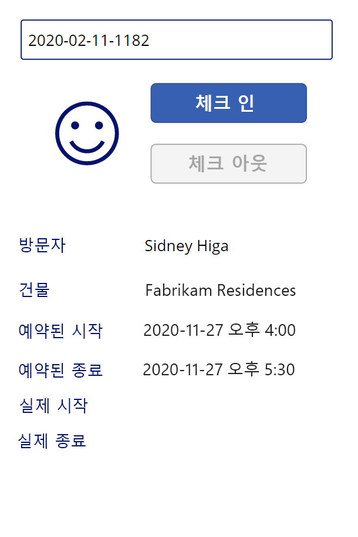

---
lab:
    title: '랩 3: 캔버스 앱 빌드 방법, 2부'
    module: '모듈 3: Power Apps 시작'
---

# 모듈 3: Power Apps 시작
## 랩 2: 캔버스 앱 빌드 방법, 2부

# 시나리오

Bellows College는 캠퍼스 내에 여러 건물이 있는 교육 기관입니다. 캠퍼스 방문은 현재 종이에 기록되어 있습니다. 이 정보는 일관되게 수집되지 않으며, 전체 캠퍼스 방문 데이터를 수집하고 분석할 방법이 없습니다. 

캠퍼스 관리부는 건물 액세스가 보안 요원에 의해 제어되고, 모든 방문이 반드시 호스트에 의해 사전 등록 및 기록되는 현대화된 방문자 등록 시스템을 원합니다.

이 과정 전반에 걸쳐 벨로즈 칼리지 관리 및 보안 담당자가 캠퍼스 내 건물에 대한 액세스를 관리하고 제어할 수 있도록 애플리케이션을 빌드하고 자동화를 수행합니다. 

이 랩의 파트 2에서는 보안 담당자가 건물 입구에서 방문자를 신속하게 확인하고 등록하는 데 사용할 Power Apps 캔버스 앱의 디자인을 만들고 빌드합니다.

# 고급 랩 단계

캔버스 앱을 디자인하려면 아래 개요를 따릅니다.

-   휴대폰 폼 팩터를 사용하여 앱 만들기
-   데이터 원본으로 Common Data Service에 연결
-   입력(방문자 코드) 내용을 확보하고 방문자 레코드를 찾습니다.
-   방문자 정보를 표시하도록 폼 뷰어 컨트롤을 구성합니다.
-   Common Data Service 뷰를 사용하여 갤러리 채우기
-   방문자의 체크 인 및 체크 아웃 프로세스를 처리합니다.

## 사전 요구 사항

* **모듈 0 랩 0 - 랩 환경 검증** 완료
* **모듈 2 랩 1 - Common Data Service 소개** 완료

## 시작하기 전에 고려해야 할 사항

-   보안 담당자가 빠르게 액세스하기 위해 필요한 정보는 무엇입니까?
-   방문자 코드가 유효하지 않은 경우 어떻게 해야 합니까?
-   방문자가 예약된 시간 이외에 도착하면 어떻게 해야 합니까? 

# 연습 \#1: 보안 캔버스 앱 만들기

**목표:** 이 연습에서는 캔버스 앱을 만듭니다.

## 작업 \#1: 캔버스 앱 만들기

1.  캠퍼스 관리 솔루션을 엽니다.

    -   <https://make.powerapps.com>에 로그인합니다

    -   오른쪽 상단에 표시되는 환경이 연습 환경이 아닌 경우, **환경**을 선택합니다. 

    -   **솔루션**을 선택합니다.

    -   클릭하여 **캠퍼스 관리** 솔루션을 엽니다.
    
2.  새 캔버스 애플리케이션 만들기

    -   **새로 만들기**를 클릭하고 **앱 \| 캔버스 앱 \| 전화 폼 팩터** 을 선택합니다.
        그러면 새 창에서 앱 편집기가 열립니다.
        
    -   Power Apps Studio 대화에 오신 것을 환영합니다가 표시되는 경우 **건너뛰기**를 클릭합니다.
    
3.  캔버스 앱을 저장합니다.

    -   **파일**을 클릭하고 **다른 이름으로 저장**을 선택합니다.
    
    -   **클라우드**가 선택되었는지 확인합니다. 
    
    -   이름에 **[사용자의 성] 캠퍼스 보안**을 입력하고 **저장**을 클릭합니다.
        
    -   앱으로 돌아가려면 왼쪽 상단 (Power Apps 아래)에있는 **뒤로** 화살표를 클릭합니다.

3.  데이터 원본에 연결(방문)

    -   **뷰 \|** 클릭 **데이터 원본**
    
    -   **모든 엔터티 보기**를 클릭합니다.
    
    -   **방문**을 선택하고 **앱**의 데이터 섹션 아래에 방문 엔터티가 표시될 때까지 기다립니다.
    
4.  진행 중인 작업을 저장하려면 **파일**을 클릭한 후 **저장**을 클릭합니다. 뒤로 화살표를 사용하여 앱으로 돌아갑니다.

## 작업 \#2: 방문자 정보 표시

1.  검색 상자 추가

    -   왼쪽 탐색 모음에서 **트리 뷰** 탭을 선택합니다.
    
    -   **Screen1**을 선택합니다.
    
    -   **삽입** 탭으로 이동합니다.
    
    -   **텍스트**를 클릭하고 **텍스트 입력**을 선택합니다.
    
2.  텍스트 입력 개체 편집

    -   텍스트 입력 개체를 선택하는 동안, **기본** 속성에서 텍스트를 선택하고 값을 지웁니다.
    
    -   **HintText** 속성을 선택하고 `"방문자 코드 입력`" 을 값으로 입력(큰따옴표 포함)
    
    -   트리 뷰(TextInput1)에서 컨트롤 이름 옆에 있는  **...** 를 클릭하고, **이름 바꾸기**를 선택하여 이름을 `textCode`로 변경합니다.
    
3.  양식 뷰 추가

    -   **삽입** 탭에서 **양식**을 클릭한 다음 **표시**를 선택합니다.
   
    -   크기 핸들을 사용하여 검색 텍스트 상자 아래 양식의 위치를 지정
   
    -   **DataSource** 속성을 선택하고 **방문 횟수**를 선택합니다.
   
    -   속성 창에서 **수평**을 **레이아웃**으로 선택합니다.

4.  양식 뷰 편집

    -   **필드 편집**을 클릭합니다.
   
    -   **필드 추가**를 클릭하고 다음 필드를 선택합니다. **실제 종료**, **실제 시작**, **건물**, **예약된 종료**, **예약된 시작**, **방문자**
   
    -   **추가**를 누릅니다.
   
    -   **이름** 및 **만든 날짜** 필드를 모두 제거합니다.
   
    -   목록에서 필드 카드를 드래그하여 선택한 필드의 순서를 변경합니다. 권장 순서는 다음과 같습니다. 방문자, 건물, 예약된 시작, 예약된 종료, 실제 시작, 실제 종료
   
    -   **X**를 클릭하여 필드 창 닫기
   
5.  양식 뷰를 선택하는 동안, 속성 창에서 고급 탭을 선택합니다. **항목** 속성을 선택하고 `LookUp(Visits, Code = textCode.Text)`를 입력합니다. 

6.  진행 중인 작업을 저장하려면 **파일**을 클릭한 후 **저장**을 클릭합니다. 뒤로 화살표를 사용하여 앱으로 돌아갑니다.

7.  앱 테스트 준비

    -   솔루션이 포함된 브라우저 탭으로 전환합니다.
   
    -   **방문** 엔터티를 선택합니다.
   
    -   **데이터** 탭을 선택합니다.
   
    -   현재 뷰 이름인 **활성 방문**을 클릭하여 오른쪽 상단에 있는 뷰 선택기 열기
   
    -   뷰를 **모든 필드**로 변경
   
    -   실제 시작 또는 실제 종료 값이 없는 방문 레코드를 찾습니다. 이 방문에 대한 **코드**를 선택하고 복사합니다.

8.  앱 테스트

    -   앱을 통해 브라우저 탭으로 전환하고, **F5** 키를 누르거나 오른쪽 상단 모서리에서 **재생** 아이콘을 클릭하여 앱을 미리 봅니다.
   
    -   복사된 값을 검색 텍스트 상자에 붙여 넣고 레코드가 양식에 표시되는지 확인합니다.
   
9.  검색 텍스트 상자 내용을 지웁니다.
   
10.  **ESC** 키를 눌러 실행 중인 앱을 종료합니다.

## 작업 \#3: 체크 인 및 체크 아웃 단추를 추가합니다.

이 작업에서는 사용자가 방문을 체크인 또는 체크아웃할 수 있는 단추를 만듭니다. 

1. 변수에 검색 결과를 저장하여 컨트롤 전체에서 재사용합니다.

    * **textCode** 컨트롤을 선택합니다.
   
    * 속성 창에서 **고급** 탭 및 **OnChange** 속성을 차례로 선택
   
    * 다음 `Set(Visit, LookUp(Visits, Code = textCode.Text))` 식을 입력합니다.
    
    > 이렇게 하면 사용자가 textCode 검색 상자에서 검색할 때 방문을 전역 변수에 저장합니다. 이를 통해 전체 조회 식을 다시 입력할 필요 없이 앱 전체에서 *방문* 변수를 사용할 수 있습니다.

2. 체크 인 단추를 추가합니다.

   * **삽입** 탭을 선택합니다.
   
   * **단추**를 클릭합니다.
   
   * 속성 창에서 단추 **텍스트** 속성을 `"체크 인"`으로 변경합니다(기존 따옴표 내에서 입력할 수 있습니다).
   
   * 트리 뷰에서 단추 이름(Button1) 옆에 있는 **...** 기호를 클릭하고 **이름 바꾸기**를 선택하여 이름을 `CheckInButton`으로 변경합니다.

3. 체크 아웃 단추를 추가합니다.   

   * 삽입 탭의 **단추**를 클릭하여 다른 단추를 삽입합니다. 
   
   * 속성 창에서 단추 **텍스트** 속성을 "`체크 아웃`"으로 변경합니다(기존 따옴표 내에서 입력할 수 있습니다).
   
   * 단추 이름을 `CheckOutButton`으로 변경합니다.
   
   * 검색 상자 아래에 단추를 배치하고 **체크 아웃** 위에 **체크 인**을 배치합니다. 
   
## 작업 \#4: 방문 데이터에 따라 단추를 활성화 및 비활성화합니다.

방문 레코드가 있고(비어 있지 않음), 레코드 상태가 활성화되어 있으며 방문이 아직 시작되지 않은 경우(즉, 실제 시작 값이 비어 있음) **체크 인** 단추를 사용하도록 설정합니다.

1. **체크 인 단추**를 선택하여 속성 탭에서 단추의 **DisplayMode** 속성을 클릭합니다.

2. 함수 표시줄에 아래 식을 입력합니다.

      ```
      If(!IsBlank(Visit) 
      && Visit.Status = 'Status (Visits)'.Active
      && IsBlank(Visit.'Actual Start'),
          DisplayMode.Edit,
          DisplayMode.Disabled
      )
      ```

   식은 다음과 같이 세분화할 수 있습니다.

   * **IsBlank(Visit)** -  방문 기록을 찾았습니다.
   * **&&** - 논리 AND 연산자
   * **Visit.Status = 'Status (Visits)'.Active** 레코드 상태는 *활성*입니다.
   * **IsBlank(Visit.'Actual Start')** - 활성 시작 필드에 데이터가 없습니다.
   * **DisplayMode.Edit, DisplayMode.Disabled** - 위의 조건이 충족되면 단추를 편집할 수 있습니다. 그렇지 않은 경우, 단추는 비활성화된 상태로 유지됩니다.

방문 레코드가 있고(비어 있지 않음) 레코드 상태가 활성화되어 있으며 방문이 이미 시작된 경우(즉, 실제 시작 값이 비어 있지 않음) **체크 아웃** 단추를 사용하도록 설정합니다.

3. 체크 아웃 단추를 선택하고 속성 탭에서 단추의 **DisplayMode** 속성을 클릭합니다.

4. 함수 표시줄에 아래 식을 입력합니다.

     ```
     If(!IsBlank(Visit) 
     && Visit.Status = 'Status (Visits)'.Active
     && !IsBlank(Visit.'Actual Start'),
         DisplayMode.Edit,
         DisplayMode.Disabled
     )
     ```

5. 진행 중인 작업을 저장하려면 **파일**을 클릭한 후 **저장**을 클릭합니다. 뒤로 화살표를 사용하여 앱으로 돌아갑니다.

6. **F5** 키를 눌러 앱을 실행합니다. 

7. 두 단추를 모두 사용하지 않도록 설정해야 합니다. 이전에 복사한 코드 값을 입력하고 **탭** 키를 눌러 텍스트 상자에서 포커스를 이동합니다. **체크 인** 단추를 사용하도록 설정해야 합니다. 

8. 검색 상자 내용을 지웁니다.

9. **ESC** 키를 눌러 실행 중인 앱을 종료합니다.

## 작업 \#5: 전체 체크 인 및 체크 아웃 프로세스

체크인 및 체크 아웃 프로세스를 수행하려면 다음과 같이 Common Data Service 방문 데이터를 업데이트해야 합니다.

* 방문자가 체크인 할 때 *실제 시작* 필드를 현재 날짜 및 시간으로 설정합니다.
* 방문자가 체크 아웃할 때 *실제 종료* 필드를 현재 날짜 및 시간으로 설정합니다. 
* 체크 아웃 후 레코드 상태를 방문이 완료되었음을 나타내는 비활성 상태로 설정합니다.

1. **체크 인** 단추를 선택합니다.

2. 고급 탭에서 **OnSelect** 속성을 다음 식으로 설정합니다.

   ```
   Patch(
       Visits,
       Visit,
       {'Actual Start': Now()}
   );
   Refresh([@Visits]);
   Set(Visit, LookUp(Visits, Code = textCode.Text));
   ```

   이 식에는 다음 부분이 포함되어 있습니다.

   * **Patch(Visits, Visit, {'Actual Start': Now()});**. *패치* 메서드는 **방문** 변수로 식별된 레코드(현재 방문)인 **방문** 엔터티를 업데이트합니다. 식은 *실제 시작* 필드의 값을 현재 날짜 및 시간(*Now()* method)으로 설정합니다.
   * **Refresh([@Visits]);**. 이 식은 기본 값이 변경됨에 따라 방문 레코드를 새로 고칩니다.
   * **Set(Visit, LookUp(Visits, Code = textCode.Text));** 이 식은 Common Data Service의 새 데이터로 *방문* 변수를 업데이트합니다.
   
   > 사용자가 이 단추를 클릭하면 실제 방문 시작이 현재 날짜와 시간으로 설정되고 데이터가 새로 고쳐집니다.

3. **체크 아웃** 단추를 선택합니다.

4. 고급 탭에서 **OnSelect** 속성을 다음 식으로 설정합니다.

   ```
   Patch(
       [@Visits],
       Visit,
       {
           'Actual End': Now(),
           Status: 'Status (Visits)'.Inactive
       }
   );
   Refresh([@Visits]);
   Set(Visit, LookUp(Visits, Code = textCode.Text));
   ```

   사용자가 이 단추를 클릭하면 실제 종료가 현재 날짜와 시간으로 설정되고 방문 상태 레코드가 비활성 상태로 설정되며 데이터가 새로 고쳐집니다.

5. 진행 중인 작업을 저장하려면 **파일**을 클릭한 후 **저장**을 클릭합니다. **뒤로** 화살표를 사용하여 앱으로 돌아갑니다.

6. **F5** 키를 누르거나 재생 단추를 클릭하여 앱을 실행합니다. 이전에 복사한 코드 값을 입력하고 **탭** 키를 눌러 텍스트 상자에서 포커스를 이동합니다. **체크 인** 단추를 사용하도록 설정해야 합니다.

7. **체크 인** 단추를 누릅니다. 다음과 같은 일이 발생합니다.

   * **실제 시작**이 현재 날짜 및 시간으로 설정됩니다.
   
   * **체크 인** 단추를 사용할 수 없습니다.
   
   * **체크 아웃** 단추가 활성화되어 있습니다.

8. **체크 아웃** 단추를 누릅니다.

   * **실제 종료**가 현재 날짜와 시간으로 설정됩니다.
   
   * 두 단추 모두 사용할 수 없습니다.

9. 검색 상자 내용을 지웁니다.

10. **ESC** 키를 눌러 실행 중인 앱을 종료합니다.

## 작업 \#6: 시각적 표시기 추가

모바일 앱의 유용성은 시각적 표시기가 제공될 때 크게 향상됩니다. 이 작업에서는 방문자를 체크인하거나 체크 아웃할 수 있는지 여부를 나타내는 아이콘을 추가합니다.

1. **삽입** 탭을 선택합니다.

2. **아이콘 \|** 을 선택합니다. **추가**합니다. 이 시점에서는 값이 동적이기를 원하기 때문에 어떤 아이콘을 선택하는지는 중요하지 않습니다.

3. 아이콘 크기를 조정한 후 단추 왼쪽에 및 배치

4. 아이콘의 고급 탭에서 (디자인 섹션의) **아이콘** 속성을 선택하고 다음 식을 입력합니다.

   ```
   If(
      CheckInButton.DisplayMode = DisplayMode.Disabled 
   && CheckOutButton.DisplayMode = DisplayMode.Disabled,
       Icon.EmojiFrown,
       Icon.EmojiSmile
   )
   ```

5. 진행 중인 작업을 저장하려면 **파일**을 클릭한 후 **저장**을 클릭합니다. **뒤로** 화살표를 사용하여 앱으로 돌아갑니다.

6. **F5** 키를 눌러 앱을 실행합니다. 이전에 복사한 코드 값을 입력하고 **탭** 키를 눌러 텍스트 상자에서 포커스를 이동합니다. 아이콘이 찡그린 이모지를 표시하는지 확인합니다.

7. 이전에 사용되지 않은 다른 코드 값을 찾습니다(실제 시작 또는 실제 종료 값이 없어야 합니다). 

    > 이전 탭으로 이동하여 이미 만든 방문 중 하나에서 다른 코드를 복사할 수 있습니다. 또한 이전에 만든 **캠퍼스 직원** 앱을 실행하여 새 방문 레코드를 만들 수도 있습니다. 아이콘이 이 코드에 대해 미소 이모티콘을 표시했는지 확인합니다.

실행 중인 앱은 다음 모양과 거의 비슷해 보여야 합니다.



8. **ESC** 키를 눌러 실행 중인 앱을 종료합니다.

## 작업 #7: 앱을 게시합니다.

1. 브라우저에 캠퍼스 보안 앱이 아직 열려 있어야 합니다. 그렇지 않다면, **캠퍼스 보안** 앱을 선택하고 **편집**을 클릭합니다.

2. **파일 \| 게시** 을 선택합니다.

3. **이 버전 게시**를 선택합니다.

# 과제

* 방문 코드를 수동으로 입력하지 마세요.
* 방문에 대한 건물 유효성 검사 추가
* 방문 실제 시간 대 방문 예약 시간(너무 일찍, 너무 늦게 등)의 유효성 검사를 추가합니다.
* 방문의 자세한 상태(예: 방문자에 대한 이메일 표시 및 유효성 검사, 건물 출입 거부 이유 등)를 추가합니다.
* 단일 캠퍼스 방문 중에 여러 건물/회의/확인 예를 들어, 누군가가 하루 동안 캠퍼스를 방문할 수 있으며, 그 하루 동안 다른 시간에 여러 건물에서 직원들을 만날 수 있습니다. *약속* 엔터티를 솔루션에 가져오는 것을 고려하시겠습니까?
