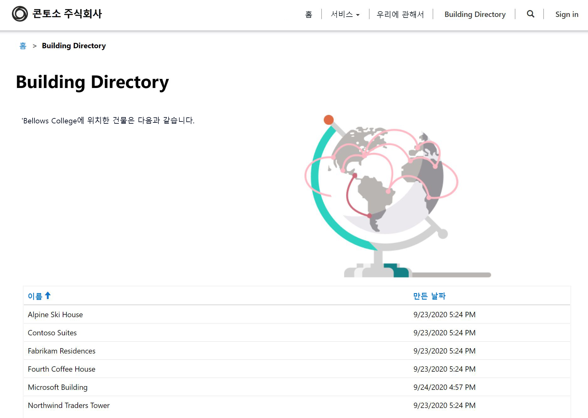

---
lab:
    title: '랩 5: Power Apps 포털을 빌드하는 방법'
    module: '모듈 3: Power Apps 시작하기'
---

# 모듈 3: Power Apps 시작하기

## 랩 4: Power Apps 포털을 빌드하는 방법

# 시나리오

Bellows College는 캠퍼스 내에 여러 건물이 있는 교육 기관입니다. 캠퍼스 방문은 현재 종이에 기록되어 있습니다. 이 정보는 일관되게 수집되지 않으며, 전체 캠퍼스 방문 데이터를 수집하고 분석할 방법이 없습니다.

캠퍼스 행정실은 방문객들에게 캠퍼스 내 건물에 대한 정보를 제공하고자 합니다. 방문자는 Power Apps 포털을 사용하여 빌드될 웹 사이트에서 건물 목록을 볼 수 있습니다.

이 랩에서는 Power Apps 포털을 프로비전하고 캠퍼스 내 건물 목록을 표시하는 포털 웹 페이지를 만듭니다.

# 고급 랩 단계

Power Apps 포털을 디자인하려면 아래 개요를 따릅니다.

* Common Data Service 환경에서 Power Apps 포털 프로비전
* 웹 페이지를 만들고 구성하여 건물 목록 표시
* 새 테마를 만들어 포털에 적용

## 사전 요구 사항

* **모듈 0 랩 0 - 랩 환경 검증** 완료
* **모듈 2 랩 1 - Common Data Service 소개** 완료

## 시작하기 전에 고려해야 할 사항

* Power Apps 포털 앱은 빈 애플리케이션 대신 언제나 템플릿에서 시작합니다. 포털을 프로비전하면 이미 페이지, 메뉴 및 기본 테마가 있습니다.

# 연습 \#1: Power Apps 포털 프로비전

**목표:** 이 연습에서는 월드 와이드 웹의 어느 곳에서나 액세스할 수 있는 사용자 환경에서 Power Apps 포털을 프로비저닝합니다.

## 작업 \#1: Power Apps 포털 프로비전

1.  새 포털 앱 만들기

    -   <https://make.powerapps.com>에 로그인합니다

    -   오른쪽 상단에 표시되는 **환경**이 연습 환경이 아닌 경우, 사용자의 환경을 선택합니다.

    -   **나만의 앱 만들기** 아래 **공백에서 포털**을  클릭합니다.

2.  새 포털의 세부 정보를 입력합니다.

    -   포털 **이름**에 **벨로즈 대학 방문자**를 입력합니다.

    -   **고유한 이름**.powerappsportals.com의 형식으로 고유한 URL을 입력합니다(사용 중인 이름이면 다른 이름을 입력합니다).

    -   포털의 기본  **언어**를 선택합니다.

    -   **만들기**를 클릭합니다.

3. 포털 프로비저닝 작업에는 30~45분 정도가 소요됩니다.  인내심을 갖고 기다려 주세요.

작업 \#2: 포털로 이동합니다.
--------------------------------

1.  포털이 프로비전된 경우 <https://make.powerapps.com>에서 알림을 받게 됩니다.

2.  새 포털을 엽니다.

    -   **앱**을 클릭합니다.

    -   **포털** **유형**이 있는 앱을 찾습니다.

    -   앱 이름을 클릭합니다.

3.  방문 페이지에 환영 메시지가 들어 있는 포털 웹 사이트로 이동합니다.

연습 \#2: 포털 웹 페이지 만들기
===============================

**목표:** 이 연습에서는 Common Data Service의 건물 목록과 일부 정적 콘텐츠를 표시하는 새 웹 페이지를 만듭니다.

작업 #1: 웹 페이지 만들기
--------------------------------

1.  Power Apps 포털 스튜디오를 엽니다.

    -   <https://make.powerapps.com>에 로그인합니다 (이 웹 사이트가 탭에 이미 열려 있을 수도 있습니다).

    -   **포털** **유형**이 있는 앱을 찾습니다.

    -   줄임표(**...**)를 클릭하여 **편집**을 선택합니다.

2.  이제 Power Apps 포털 스튜디오에 들어왔습니다. 여기서 포털 콘텐츠를 수정하고 만들 수 있습니다.

3.  새 페이지 만들기

    -   명령 모음에서 **새로 만들기**를 선택합니다.

    -   **고정된 레이아웃** 위에 마우스 포인터를 올려 **제목이 있는 페이지**를 선택합니다.

4.  페이지 속성 수정

    -   속성 창에서 **표시** 아래 **이름**을 **새 페이지 (1)** 에서 **건물 디렉터리**로 변경하고, Tab 키를 눌러서 자동 저장을 시작합니다.

    -   이제 페이지 제목은 **건물 디렉터리**로 표시되어야 합니다.

    -   **부분 URL**에서 값을 **building-directory** 로 변경하고 Tab 키를 눌러 자동 저장을 시작합니다.

작업 #2: 정적 콘텐츠 추가
--------------------------------

1.  웹 페이지에 섹션 추가

    -   캔버스(웹 페이지 표시 영역)에서 **페이지 복사** 섹션을 선택합니다. 페이지 중간에 있는 텍스트 2문장을 둘러싼 큰 상자입니다.

    -   도구 벨트(왼쪽)에서 **구성 요소** 아이콘을 선택합니다.

    -   **섹션 레이아웃** 영역에서 **두 개의 열 섹션**을 선택합니다.

2.  정적 텍스트 추가

    -   캔버스(웹 페이지 표시 영역)에서 왼쪽 열을 선택합니다.

    -   도구 벨트(왼쪽)에서 **구성 요소** 아이콘을 선택합니다.

    -   **포털 구성 요소** 영역에서 **텍스트**를 선택합니다.

    -   새 텍스트 영역에 다음 텍스트를 입력합니다.
          ```
          The following is the building directory.
          ```
    -   방금 편집한 텍스트 상자 위의 텍스트를 선택하고 명령 모음의 **삭제**를 클릭하여 기본 텍스트를 제거합니다.

3. 이미지 추가

    -   캔버스(웹 페이지 표시 영역)에서 우측 열을 선택합니다.

    -   도구 벨트(왼쪽)에서 **구성 요소** 아이콘을 선택합니다.

    -   **포털 구성 요소** 영역에서 **이미지**를 선택합니다.

    -   속성 창에서 **이미지 선택**을 클릭합니다. **Product A.png**를 찾아 선택합니다.
    
    -   속성 창에서 서식 섹션 드롭다운을 클릭하고 **너비**를 70%로 변경합니다(반드시 %를 입력해야 합니다). 이미지 크기가 원하는 크기로 될 때까지 조정할 수 있습니다.

4.  **웹 사이트 찾아보기**를 클릭하여 지금까지 작업된 페이지를 봅니다.  메인 메뉴에 **건물 디렉터리** 옵션이 있는지 확인합니다.

작업 #3: 목록 구성 요소 추가
--------------------------------

1.  Power Apps 포털 스튜디오를 엽니다.

    -   <https://make.powerapps.com> 에 로그인합니다 (이 웹 사이트가 탭에 이미 열려 있을 수도 있습니다).

    -   **포털** **유형**이 있는 앱을 찾습니다.

    -   줄임표(**...**)를 클릭하여 **편집**을 선택합니다.
    
2.  이전에 만든 기존 페이지 편집

    -   도구 벨트(왼쪽)에서 **페이지** 옵션을 선택합니다. 

    -   이전에 만든 **건물 디렉터리** 페이지를 찾아 선택합니다.
    
3.  목록 구성 요소 추가

    -   도구 벨트(왼쪽)에서 **구성 요소** 아이콘을 선택합니다.

    -   **섹션 레이아웃** 영역에서 **하나의 열 섹션**을 선택합니다(웹 페이지의 이미지와 텍스트 아래에 섹션이 나타납니다).

    -   캔버스의 새 열 섹션을 선택합니다.

    -   도구 벨트(왼쪽)에서 **구성 요소** 아이콘을 선택합니다.

    -   **포털 구성 요소** 영역에서 **목록**을 선택합니다. (목록 구성 요소가 새 섹션에 나타납니다.)
    
4.  목록 구성 요소 구성

    -   캔버스에서 목록 구성 요소를 선택합니다.

    -   속성 창(오른쪽)에서 **이름** 필드에 **건물 목록**을 입력합니다.

    -   **엔터티** 필드의 드롭다운 목록에서 **건물**을 선택합니다.

    -   **뷰**에서 **활성 건물**을 선택합니다.

    -   나머지 기본 설정은 그대로 둡니다.
    
5.  **웹 사이트 찾아보기**를 클릭하여 페이지를 봅니다. 웹 페이지에 Common Data Service 의 건물 목록이 표시되어야 합니다.

연습 \#3: 포털 테마 변경
===============================

**목표:** 이 연습에서는 포털의 색 구성표를 변경하는 새 테마를 만듭니다. 

작업 #1: 테마 적용 및 편집
--------------------------------

1.  Power Apps 포털 스튜디오를 엽니다.

    -   <https://make.powerapps.com>에 로그인합니다 (이 웹 사이트가 탭에 이미 열려 있을 수도 있습니다).

    -   **포털** **유형**이 있는 앱을 찾습니다.

    -   줄임표(**...**)를 클릭하여 **편집**을 선택합니다.
    
2.  기본 테마 적용과 사용자 정의

    -   도구 벨트(왼쪽)에서 **구성 요소** 아이콘을 선택합니다.
    
    -   **기본 테마 사용**을 위한 토글을 클릭하여 이 기능을 켭니다.
    
    -   사전 설정 중 하나에서, 줄임표(**...**)를 클릭하여 **사용자 정의**를 선택합니다.
    
    -   기본 테마의 복사본이 만들어졌습니다. 
    
    -   속성 창에서 색상을 바꿔 가며 색상 변경이 포털에 미치는 영향을 살펴봅니다.
    
    -   테마 이름 바꾸기
    
3.  변경 내용 저장

    -   명령 모음에서 **동기화 구성**을 클릭합니다.


앱 레이아웃은 다음 모양과 비슷해야 합니다.



# 과제

* 건물 이름만 표시하는 건물의 다른 뷰를 만듭니다. 변경 내용을 보려면 포털 스튜디오에서 **웹 사이트 찾아보기**를 선택해야 합니다.
* 도구 벨트에서 **테마** 아이콘을 클릭하고 사용자 지정 테마의 CSS를 편집합니다.
* **양식** 구성 요소가 있는 페이지를 만들고 **목록** 구성 요소를 수정하여 양식이 있는 Common Data Service 레코드를 추가하거나 편집합니다.
* **목록** 구성 요소 **설정**에서 **엔터티 권한**을 사용으로 설정합니다. 데이터에 어떤 일이 발생하나요?
* 포털 스튜디오에서 소스 코드 편집기 아이콘 `</>`을 선택하여 페이지 소스를 봅니다. HTML에 익숙하다면 몇 가지 수정을 하고 결과를 확인합니다.
