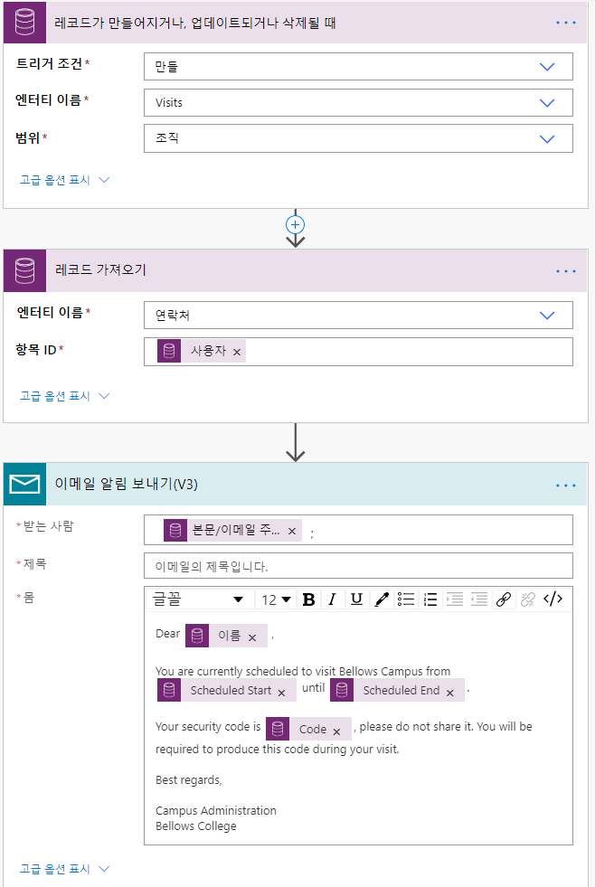

---
lab:
    title: '랩 6: 자동화된 솔루션을 빌드하는 방법'
    module: '모듈 4: Power Automate 시작하기'
---

# 모듈 4: Power Automate 시작하기
## 랩: 자동화된 솔루션을 빌드하는 방법

## 시나리오

Bellows College는 캠퍼스 내에 여러 건물이 있는 교육 기관입니다. 캠퍼스 방문자는 현재 종이 저널에 기록되어 있습니다. 이 정보는 일관되게 수집되지 않으며, 전체 캠퍼스 방문 데이터를 수집하고 분석할 방법이 없습니다. 

캠퍼스 관리부는 건물 액세스가 보안 요원에 의해 제어되고, 모든 방문이 반드시 호스트에 의해 사전 등록 및 기록되는 현대화된 방문자 등록 시스템을 원합니다.

이 과정 전반에 걸쳐 벨로즈 칼리지 관리 및 보안 담당자가 캠퍼스 내 건물에 대한 액세스를 관리하고 제어할 수 있도록 애플리케이션을 빌드하고 자동화를 수행합니다. 

이 랩에서는 캠퍼스 관리의 다양한 부분을 자동화하는 Power Automate 흐름을 만듭니다. 

# 고급 랩 단계

프로젝트 완료를 위해 구현해야 하는 요구 사항은 다음과 같습니다.

* 각 방문자에게 할당된 고유 코드는 방문 전에 사용할 수 있어야 합니다.
* 보안 담당자는 예정된 시간대를 초과하여 머무는 방문자에 대한 알림을 받아야 합니다.

## 사전 요구 사항

* **모듈 0 랩 0 - 랩 환경 검증** 완료
* **모듈 2 랩 1 - Common Data Service 소개** 완료
* 캠퍼스 직원 앱은 **모듈 3 랩 2 – 캔버스 앱 빌드 방법, 2부**(테스트용)에서 만들었습니다.
* 개인 전자 메일 주소로 만든 John Doe의 연락처는 **모듈 3 랩 4 - 모델 기반 앱 빌드 방법**(테스트용)에서 만들었습니다.

## 시작하기 전에 고려해야 할 사항

-   방문자 코드에 가장 적합한 배포 메커니즘은 무엇인가요?
-   체류 연장을 측정하고 엄격한 정책을 시행하려면 어떻게 해야 하나요?

# 연습 \#1: 방문 알림 흐름 만들기

**목표:** 이 연습에서는 요구 사항을 구현하는 Power Automate 흐름을 만듭니다. 방문자는 방문에 할당된 고유 코드를 포함하는 전자 메일을 보내야 합니다.

## 작업 \#1: 흐름 만들기

1.  캠퍼스 관리 솔루션을 엽니다.

    -   <https://make.powerapps.com>에 로그인합니다

    -   **환경**을 선택합니다.

    -   **솔루션**을 선택합니다.

    -   클릭하여 **캠퍼스 관리** 솔루션을 엽니다.

2.  **새로 만들기**를 클릭하고 **흐름**을 선택합니다. 그러면 새 창에서 Power Automate 흐름 편집기가 열립니다.

3. *현재*를 검색하고 **Common Data Service(현재 환경)** 커넥터를 선택합니다.

4. **레코드가 만들어지고 업데이트되거나 삭제될 경우** 트리거를 선택합니다.

   * **트리거 조건**에 대한 **만들기** 선택
   
   * **엔터티 이름**에 대한 **방문** 선택
   
   * **범위**에 대한 **조직** 선택
   
   * 트리거 단계에서 줄임표(**...**)를 클릭하고 **이름 바꾸기**를 클릭합니다. 이 트리거의 이름을 **"방문이 생성될 때"** 로 바꿉니다. 이것은 좋은 연습이므로 사용자 및 기타 흐름 편집자는 세부 정보에 대해 자세히 살펴볼 필요 없이 이 단계의 목적을 이해할 수 있습니다.

5.  **새 단계**를 클릭합니다. 이 단계는 전자 메일을 포함하여 방문자 정보를 검색하는 데 필요합니다.

6. *현재*를 검색하고 **Common Data Service(현재 환경)** 커넥터를 선택합니다.

7. **레코드 받기** 작업을 선택합니다. 

   * **연락처**를 **엔터티 이름**으로 선택합니다.
   
   * **항목 ID** 필드에서 동적 콘텐츠 목록의 **방문자(값)** 를 선택합니다.
   
   * 이 작업에서 줄임표([...])를 클릭하고 **이름 바꾸기**를 클릭합니다. 이 작업의 이름을 **"방문자 받기"** 로 바꿉니다. 이것은 좋은 연습이므로 사용자 및 기타 흐름 편집자는 세부 정보에 대해 자세히 살펴볼 필요 없이 이 단계의 목적을 이해할 수 있습니다.

8. **새 단계**를 클릭합니다. 이 단계는 방문자에게 전자 메일을 만들고 보내는 단계입니다.

9. *메일*을 검색하고 **메일** 커넥터를 선택해서 **전자 메일 알림 보내기** 작업을 찾습니다. 

   * 이 작업을 사용하기 위한 사용 약관을 수락하라는 메시지가 표시되면 **수락**을 클릭합니다.
   
   * **대상** 필드를 선택하고 동적 콘텐츠 목록에서 **전자 메일**을 선택합니다. **방문자 가져오기** 헤더 아래에 있습니다. 즉, 이전 단계에서 조회한 방문자와 관련된 전자 메일을 선택합니다. 

   * **벨로즈 대학 예약 방문**을 **제목** 필드에 입력합니다.

   * **전자 메일 본문**에 다음 텍스트를 입력합니다.  
        
        > 필드가 괄호로 명명되는 곳에 동적 콘텐츠를 배치해야 합니다. 먼저 모든 텍스트를 복사하여 붙여넣은 다음 올바른 장소에 동적 콘텐츠를 추가하는 것이 좋습니다.
   
        ```
        친애하는 {First Name},

        현재 {Scheduled Start}에서 {Scheduled End}까지 벨로즈 캠퍼스를 방문할 예정입니다.

        보안 코드는 {Code}이며 공유하지 마세요. 방문하는 동안 이 코드를 생성해야 합니다.

        안녕히계세요.

        캠퍼스 관리
        벨로즈 대학
        ```
   
10.  맨 위에 있는 **제목 없음** 흐름 이름을 선택하고 `알림 방문` 으로 이름을 바꿉니다.

11. **저장**을 누릅니다

    다음 작업에 대해 이 흐름 탭을 열어 둡니다. 흐름은 대략 다음과 같아야 합니다.



## 작업 \#2: 흐름의 유효성 검사 및 테스트

1.  브라우저에서 새 탭을 열고 <https://make.powerapps.com>으로 이동합니다.

2.  **앱**을 클릭하고 만들었던 **캠퍼스 직원** 앱을 선택합니다.

3.  이 탭을 열어 두고 흐름이 있는 이전 탭으로 다시 이동합니다. 

4.  명령 모음에서 **테스트**를 클릭합니다. **트리거 작업 수행**을 선택한 다음 **저장 및 테스트**를 선택합니다.

5.  흐름 탭을 열어 두고 **캠퍼스 직원** 앱이 있는 이전 탭으로 돌아갑니다.

6.  **+** 를 눌러 새 방문 레코드를 추가합니다.

7.  **John Doe**를 **이름**으로 입력하고 아무 **건물**이나 선택합니다.

8.  **John Doe**를 **방문자**로 선택합니다.

9.  향후 모든 날짜에 **예약된 시작** 및 **예약된 종료 날짜**를 선택합니다.

10.  **확인 표시** 아이콘을 눌러 새 방문을 저장합니다.

11.  흐름을 테스트하고 있는 이전 탭으로 다시 이동합니다. 흐름이 실행되는 것을 지켜봅니다. 오류가 있는 경우 뒤로 돌아가서 흐름을 위의 예제와 비교합니다. 전자 메일을 성공적으로 보낸 경우 받은 편지함으로 이메일을 받게 됩니다. 

12.  명령 표시줄에서 뒤로 화살표를 클릭합니다.

13.  **세부 정보** 섹션에서 **상태**가 **켜짐**으로 설정된 것을 확인할 수 있습니다. 즉, 새 방문이 생성될 때마다 흐름을 해제할 때까지 흐름이 실행됩니다. 흐름이 실행될 때마다 **28일간의 실행 기록** 목록에 추가됩니다.

14.  명령 표시줄에서 **꺼짐**을 클릭하여 흐름을 끕니다. 이 옵션을 보려면 줄임표(**...**)를 눌러야 합니다.

15.  이 창을 닫습니다.

# 연습 #2: 보안 스윕 흐름 만들기

**목표:** 이 연습에서는 요구 사항을 구현하는 Power Automate 흐름을 만듭니다. 보안 스윕은 15분마다 실시되며 방문자가 예정된 시간을 초과하여 머물면 보안 알림이 전송됩니다.

## 작업 #1: 레코드를 검색하는 흐름을 만듭니다

1. 캠퍼스 관리 솔루션을 엽니다.

   -   <https://make.powerapps.com>에 로그인합니다

   -   **환경**을 선택합니다.

   -   **솔루션**을 선택합니다.

   -   클릭하여 **캠퍼스 관리** 솔루션을 엽니다.

2. **새로 만들기**를 클릭하고 **흐름**을 선택합니다. 그러면 새 창에서 Power Automate 흐름 편집기가 열립니다.

3. *되풀이*를 검색하고 **예약** 커넥터와 **되풀이** 트리거를 선택합니다.

4. **간격**을 **15분**으로 설정합니다.

5. **새 단계**를 클릭합니다. *현재*를 검색하고 **Common Data Service(현재 환경)** 커넥터를 선택합니다. **레코드 나열** 작업을 선택합니다.

   * **엔터티 이름**으로 **방문**을 입력합니다.
   
   * **고급 옵션 표시**를 클릭합니다.

   * 다음 식을 **필터 쿼리**로 입력합니다.

   ```
     statecode eq 0 and bc_actualstart ne null and bc_actualend eq null and Microsoft.Dynamics.CRM.OlderThanXMinutes(PropertyName='bc_scheduledend',PropertyValue=15)
   ```
   
   * 세분화하면 다음과 같습니다.
       * **statecode eq 0**는 활성 방문을 필터링합니다(상태가 활성 상태인 방문)
       * **bc_actualstart ne null**은 실제 시작에 값이 있는 방문으로 검색을 제한합니다(예: 체크 인이 있었음)
       * **bc_actualend eq null**은 체크 아웃이 없었던 방문으로 검색을 제한합니다(실제 종료는 값이 없음) 
       * **Microsoft.Dynamics.CRM.OlderThanXMinutes(PropertyName='bc_scheduledend',PropertyValue=15)** 는 방문이 15분 이상 전에 완료되었어야 하는 경우 방문을 제한합니다.

   * 이 작업에서 줄임표(**...**)를 클릭하고 **이름 바꾸기**를 클릭합니다. 이 작업의 이름을 **"15분 보다 이전에 종료된 활성 방문 나열"** 로 바꿉니다. 이것은 좋은 연습이므로 사용자 및 기타 흐름 편집자는 세부 정보에 대해 자세히 살펴볼 필요 없이 이 단계의 목적을 이해할 수 있습니다.

6.  **새 단계**를 클릭합니다. *적용*을 검색하고 **각 작업에 적용**을 선택합니다 

7.  **이전 단계에서 출력 선택** 필드의 동적 콘텐츠에서 **값**을 선택합니다. 그것은 **15분 보다 이전에 종료된 활성 방문 나열** 회색 헤더 아래에 있습니다. 즉, 이전 단계에서 조회한 방문 목록을 선택합니다. 

8.  관련 레코드에 대한 건물 데이터 검색

    * 각 루프에 적용 내부의 **작업 추가**를 클릭합니다.
    
    * *현재*를 검색하고 **Common Data Service(현재 환경)** 커넥터를 선택합니다. 
    
    * **레코드 받기** 작업을 선택합니다.
    
    * **건물을** **엔터티 이름**으로 선택합니다
    
    * 동적 콘텐츠 목록에서 **항목 ID**로 **건물(값)** 을 선택합니다.
    
    * **레코드 받기** 옆의 **...** 를 클릭하고 **이름 바꾸기**를 선택합니다. **건물 받기**를 단계 이름으로 입력합니다.
    
9.  관련 레코드에 대한 방문자 데이터 검색

    * 각 루프에 적용 내부의 **작업 추가**를 클릭합니다.
    
    * *현재*를 검색하고 **Common Data Service(현재 환경)** 커넥터를 선택합니다.
    
    * **레코드 받기** 작업을 선택합니다.
    
    * **연락처**를 **엔터티 이름**으로 선택합니다.
    
    * 동적 콘텐츠에서 **항목 ID**로 **방문자(값)** 를 선택합니다.
    
    * **레코드 받기** 옆의 **...** 를 클릭하고 **이름 바꾸기**를 선택합니다. **방문자 받기**를 단계 이름으로 입력합니다.
    
11.  이메일 알림 보내기

     * 각 루프에 적용 내부의 **작업 추가**를 클릭합니다. **전자 메일 알림 보내기** 작업을 **메일** 연결에서 추가합니다.

12.  전자 메일 주소를  **받는 사람**으로 입력합니다.

13.  **제목** 필드에 다음을 입력합니다. **전체 이름**은 **방문자 가져오기** 단계의 동적 콘텐츠입니다.

   ```
   {Full Name} 체류 연장
   ```
   
14.  **본문** 필드에 다음을 입력합니다. **이름**은 **건물 받기** 단계의 동적 콘텐츠입니다.

   ```
   건물에 체류 연장 방문자가 있습니다 {Name}
         
   최고의
         
   캠퍼스 보안
   ```

17.  왼쪽 상단에서 **제목 없음**이라는 흐름을 선택하고 **보안 스윕**으로 이름을 바꿉니다.

18.  **저장**을 누릅니다

    흐름은 대략 다음과 같아야 합니다.


## 작업 #2: 흐름의 유효성 검사 및 테스트

흐름에 명시된 요구 사항을 충족하는 방문이 있는 경우, 흐름이 이메일(이전에 홍길동 연락처를 만들 때 지정한 이메일로)을 보내기 시작합니다.

1. 다음과 같은 방문 레코드가 있는지 확인합니다.

   1. 방문 레코드를 찾거나 생성합니다
   
   2. 예약된 종료 시간이 과거입니다 (15분 이상)
   
   3. 실제 시작 값은 있습니다.
   
   > **참고**: 이 데이터를 보려면, 새 탭에서 make.powerapps.com으로 이동합니다. 왼쪽 창에 있는 솔루션을 클릭하여 솔루션을 찾습니다. 방문 엔터티를 선택한 다음, 데이터 탭을 선택합니다. 오른쪽 상단 모서리에 있는 활성 방문을 클릭하여 뷰 선택기를 표시한 다음 모든 필드를 선택합니다.
   
2. 솔루션으로 이동하여 **보안 스윕** 흐름을 찾습니다. **...** 를 클릭하고 **편집**을 클릭합니다.

3. 흐름이 열리면 **테스트**를 클릭합니다.

4. **트리거 작업 수행**을 선택합니다.

5. **테스트** 및 **흐름 실행**을 클릭합니다.

6. 흐름이 완료되면 **완료**를 클릭합니다. 

7. **각 항목에 적용**을 펼친 다음 **전자 메일 알림 보내기** 단계를 펼칩니다. **제목**과 **전자 메일 본문** 값을 확인합니다.

8. 솔루션으로 이동하여 흐름 옆의 **...** 를 클릭하고 **꺼짐**을 선택합니다. 이는 테스트 시스템의 일정에 따라 흐름이 실행되지 않도록 하기 위한 것입니다.

# 과제

* 실제 시작 및 예약된 종료를 전자 메일 본문에 추가합니다.
* 전자 메일 본문에서 사용자에게 편리한 날짜 형식을 보장하려면 어떻게 해야 하나요?
* 체류 연장 정보가 있는 테이블을 생성하고 단일 전자 메일만 보낼 수 있습니까?
* 방문 코드에 대한 바코드를 생성할 수 있습니까? 언제 유용할까요?
