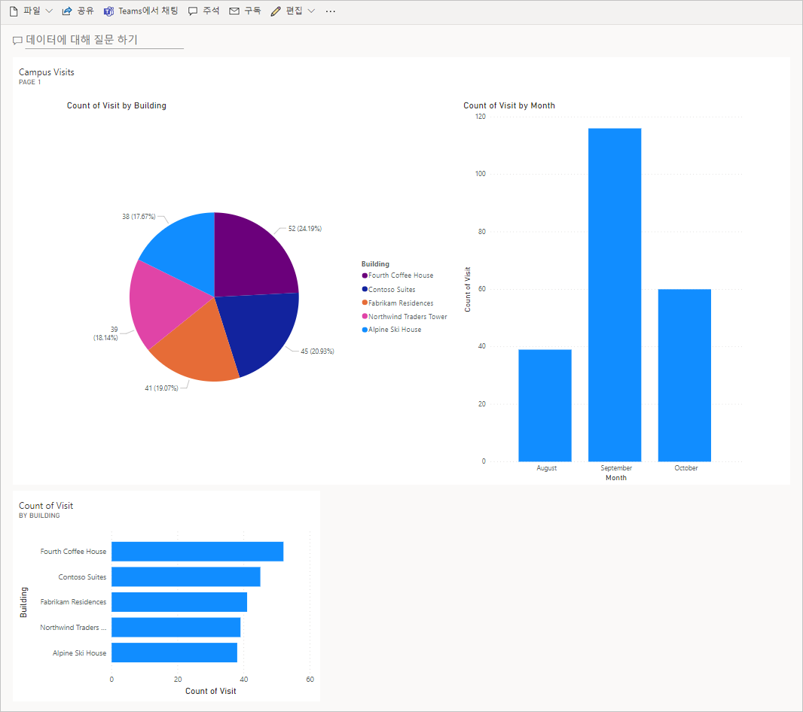

---
lab:
    title: '랩 7: 간단한 대시보드를 빌드하는 방법'
    module: '모듈 5: Power BI 시작하기'
---

# 모듈 5: Power BI 시작하기
## 랩: 간단한 대시보드를 빌드하는 방법

시나리오
========

Bellows College는 캠퍼스 내에 여러 건물이 있는 교육 기관입니다. 캠퍼스 방문자는 현재 종이 저널에 기록되어 있습니다. 이 정보는 일관되게 수집되지 않으며, 전체 캠퍼스 방문 데이터를 수집하고 분석할 방법이 없습니다. 

캠퍼스 관리부는 건물 액세스가 보안 요원에 의해 제어되고, 모든 방문이 반드시 호스트에 의해 사전 등록 및 기록되는 현대화된 방문자 등록 시스템을 원합니다.

이 과정 전반에 걸쳐 벨로즈 칼리지 관리 및 보안 담당자가 캠퍼스 내 건물에 대한 액세스를 관리하고 제어할 수 있도록 애플리케이션을 빌드하고 자동화를 수행합니다. 

이 랩에서는 캠퍼스 방문에 대한 데이터를 시각화하는 Power BI 대시보드를 빌드합니다.

고급 랩 단계
======================

Power BI 대시보드를 디자인하고 만들기 위해 아래 단계를 따릅니다:

-   Common Data Service에 연결 
-   관련 레코드(조회)에 대한 사용자에게 친숙한 설명을 포함하도록 데이터 변환
-   캠퍼스 방문 정보의 다양한 시각화를 통해 보고서를 만들고 게시
-   추가 시각화를 빌드하는 사용자 자연어 쿼리 활용
-   Power BI 대시보드의 모바일 뷰 빌드


## 사전 요구 사항

* **모듈 0 랩 0 - 랩 환경 검증** 완료
* **모듈 2 랩 1 - Common Data Service 소개** 완료

시작하기 전에 고려해야 할 사항
-----------------------------------

-   보고서의 대상 그룹은 누구입니까?
-   대상 그룹은 보고서를 어떻게 소비합니까? 일반적인 디바이스는 무엇인가요? 위치?
-   시각화할 데이터가 충분합니까?
-   방문 데이터를 분석하는 데 사용 가능한 특징은 무엇입니까?

연습 \#1: Power BI 보고서 만들기 
===============================

**목표:** 이 연습에서는 Common Data Servic 데이터베이스의 데이터를 기반으로 Power BI 보고서를 만듭니다.

태스크 \#1: Power BI Desktop 설치 / Power BI 서비스 준비
---------------------------

1.  Power BI Desktop이 설치되어 있지 않은 경우 [https://aka.ms/pbidesktopstore](https://aka.ms/pbidesktopstore)로 이동하여 Power BI 앱을 다운로드하고 설치합니다.

> [!중요]
> Microsoft Store를 사용하여 Power BI Desktop을 설치하는 데 문제가 발생하면 [https://aka.ms/pbiSingleInstaller](https://aka.ms/pbiSingleInstaller)에서 다운로드할 수 있는 독립 실행형 설치 프로그램을 사용해보세요.

2. **Power BI Desktop을 성공적으로 설치한 경우 [작업 \#2](#task-2-prepare-data)를 건너뛰세요**. 데스크톱 애플리케이션을 설치할 수 있는 권한이 없거나 Power BI Desktop을 실행 또는 구성하는 데 어려움이 있는 경우, 아래의 작업 단계를 완료한 다음 [작업 \#3](#task-3-create-chart-and-time-visualizations)을 계속하세요. 그러나 Power BI Desktop 대신 랩 전체에서 온라인 Power BI 서비스 [https://app.powerbi.com](https://app.powerbi.com)를 사용합니다. 

3. [visits.pbix](../../Allfiles/visits.pbix)를 다운로드하여 컴퓨터에 저장합니다.

4. [https://app.powerbi.com/](https://app.powerbi.com/)으로 이동한 후 **로그인**을 클릭합니다. 

5. **내 작업 영역**을 클릭합니다. 

6. **데이터 받기** 페이지가 표시되면 **건너뛰기**를 클릭합니다. 

6. **+새로 만들기** 를 펼치고 **파일 업로드**를 선택합니다.

7. **로컬 파일**을 선택합니다.

8. 이전에 다운로드한 **visits.pbix** 파일을 찾아 선택합니다.

9. 데이터 로드가 완료되면 **방문** 보고서를 선택합니다(형식이 **Report**로 설정되어 있음을 알 수 있음).

10. **편집**을 클릭하세요. **편집** 메뉴 항목이 표시되지 않으면 **...** 를 클릭한 다음 **편집**을 선택합니다.

11. [작업 \#3](#task-3-create-chart-and-time-visualizations)을 계속합니다.

작업 \#2: 데이터 준비
---------------------------

1.  조직 URL 알아보기

    * 새 탭에서 Power Platform 관리 센터 https://admin.powerplatform.com로 이동합니다.
    
    * 왼쪽 탐색 페이지에서 환경을 선택한 다음 연습 환경을 엽니다.
    
    * **세부 정보** 패널에서 **환경 URL**을 마우스 오른쪽 단추로 클릭한 다음 **링크 복사**를 선택합니다.
    
2.  Power BI Desktop을 열고 메시지가 표시되면 로그인합니다.

2. **데이터 가져오기**를 선택합니다.

3. 왼쪽에서 **Power Platform**을 선택한 다음 **Common Data Service**를 선택하고 **연결**을 누릅니다.

4. 이전에 복사한 환경 URL을 **서버 URL** 필드에 붙여넣은 다음 **확인**을 누릅니다.

5. **엔터티** 노드를 확장한 후 **bc_Building** 및 **bc_Visit** 엔터티를 선택하고 **로드**를 클릭합니다.

6. 왼쪽 세로 도구 모음에서 **모델**아이콘을 클릭합니다.

7. **bc_Building** 테이블에서 **bc_buildingid** 열을 드래그하여 **bc_Visit** 테이블의 **bc_building** 열로 놓습니다. 그러면 Power BI가 관련 데이터를 표시하는 데 사용할 수 있는 두 엔터티 간의 관계가 생성됩니다.

8. 왼쪽 도구 모음에서 **보고서** 아이콘을 선택합니다.

9. **필드** 패널에서 **bc_Visit** 노드를 확장합니다.

10. **bc_Visit** 옆의 **...** 를 클릭하고 **새 열**을 선택합니다.

11. 다음과 같이 수식을 완료하세요

    ```
    Column = RELATED(bc_Building[bc_name])
    ```

    ENTER 키를 누릅니다. 방문 데이터에 건물 이름이 있는 새 필드가 추가됩니다.

12. 방금 만든 **열** 필드 옆에 있는 **...** 를 클릭하고 **이름 바꾸기**를 선택합니다. **건물**을 필드 이름으로 입력합니다.

13. **bc_visitid** 필드 옆의 **...** 를 클릭하고 **이름 바꾸기**를 선택합니다. **방문**을 필드 이름으로 입력합니다.

14. **bc_scheduledstart** 필드 옆에 있는 **...** 를 클릭하고 **이름 바꾸기**를 선택합니다. 필드 이름으로 **시작**을 입력합니다.

15. **파일 \|** 을 눌러 진행 중인 작업을 저장합니다. **저장하고** 선택한 파일 이름을 입력합니다.

## 작업 #3: 차트 및 시간 시각화를 만듭니다

1. **시각화** 패널에서 원형 차트 아이콘을 눌러 차트를 삽입합니다.

2. **건물** 필드를 끌어서 **범례** 상자에 드롭합니다.

3. **방문** 필드를 끌어서 **값** 대상 상자에 드롭합니다.

4. 모든 차트 구성 요소가 표시되도록 코너 핸들을 사용하여 원형 차트의 크기를 조정합니다.

5. 원형 차트 외부의 보고서를 클릭하여 선택을 취소하고 **시각화** 창에서 누적된 열 차트를 선택합니다. 

6. **방문** 필드를 끌어서 **시각화** 대상 상자에 드롭합니다.

7. **시작** 필드를 끌어서 **축** 대상 상자에 놓습니다.

8. 시각화 창에서 **일** 및 **분기** 옆의 **x**를 클릭하여 축의 **연도** 및 **월** 합계만 남겨둡니다.

9. 모서리 핸들을 사용하여 필요에 따라 차트 크기를 조정합니다.

10. 보고서 상호 작용 테스트:

    * 원형 차트에서 다양한 건물 조각을 선택하고 시간 보고서의 변경 사항을 관찰합니다.
    
    * 열 차트를 클릭합니다. 아래쪽 화살표를 눌러 **드릴다운** 모드를 켜고 열을 눌러 다음 단계(개월)로 드릴다운합니다. 이 작업을 수행하는 또 다른 방법은 **데이터/드릴 \** 을 클릭하는 것입니다.**|** 리본에서 **다음 레벨을 확장**합니다.
    
    * 시간 세로 막대형 차트에서 다양한 막대를 선택하고 원형 보고서의 변경 내용을 관찰합니다.
    
11. **파일 \|** 을 눌러 진행 중인 작업을 저장합니다. **저장합니다**.

연습 #2: Power BI 대시보드 만들기
================================

## 작업 #1: Power BI 보고서 게시

1. 리본의 홈 탭에서 **게시** 단추를 누릅니다.

2. **내 작업 영역**을 대상으로 선택한 다음 **선택**을 누릅니다.

3. 게시가 완료될 때까지 기다렸다가 **Power BI에서 \<name of your report\>.pbix 열기** 를 클릭합니다.

## 작업 #2: Power BI 대시보드 만들기

1. 이전 작업의 보고서가 열려있습니다.

2. 메뉴에서 **대시보드에 고정**을 선택합니다. 레이아웃에 따라 추가 메뉴 항목을 표시하기 위해 **...** 를 눌러야 할 수도 있습니다.

3. **대시보드에 고정** 프롬프트에서 **새 대시보드**를 선택합니다.

4. **[사용자의 성] 캠퍼스 관리**를 **대시보드 이름**으로 입력하고 **라이브 고정**을 누릅니다.

5. 상단의 **내 작업 영역**을 선택하고 **[사용자의 성] 캠퍼스 관리** 대시보드를 선택합니다.

6. 표시된 원형 및 막대형 차트의 대화형 작업을 테스트합니다.

## 작업 #3: 자연어를 사용하여 시각화 추가

1. **캠퍼스 관리** 대시보드 내에서 맨 위에 있는 **데이터에 대해 질문하기**를 선택합니다.

2. Q&A 영역에서 **방문 수에 따라 건물**을 입력합니다. 막대형 차트가 표시됩니다.

3. **시각적 개체 고정**을 선택합니다.

4. **기존 대시보드**를 선택하고 **[사용자의 성] 캠퍼스 관리** 대시보드를 선택한 후 **고정**을 누릅니다.

5. **Q&A 종료**를 클릭합니다.

6. **[사용자의 성] 캠퍼스 관리** 대시보드로 이동합니다. 다음과 유사하게 나타나야 합니다.

    

## 작업 #4: 휴대폰 뷰를 빌드하고 QR 코드로 보고서를 공유합니다.

1. 대시보드에서 **편집 \| 모바일 뷰** 를 선택합니다.

2. 원하는 대로 타일을 다시 배열합니다.

3. 오른쪽 상단의 **휴대폰 뷰**를 클릭하고 뷰를 **웹 뷰**로 변경합니다.

4. 맨 위에 있는 **내 작업 영역**을 선택하고 해당 **보고서**를 선택합니다.

5. **편집**을 선택한 다음 **... \| QR 코드 생성** 을 선택합니다.

6. 모바일 디바이스가 있는 경우 iOS 및 Android 플랫폼에서 사용할 수 있는 QR 스캐너 앱을 사용하거나 휴대폰에서 지원하는 경우 카메라 앱을 사용하여 코드를 스캔합니다. 메시지가 표시되면 계정에 로그인합니다.

7. 모바일 디바이스에서 보고서로 이동하여 탐색합니다.

# 과제

* 캠퍼스 및 건물 계획을 포함하는 대시보드 및 보고서
* 방문 패턴 및 동향 보고 및 분석
* 오버스테이 시각화
* 대규모 캠퍼스에서 거의 실시간 처리를 위한 Power BI 스트리밍 
