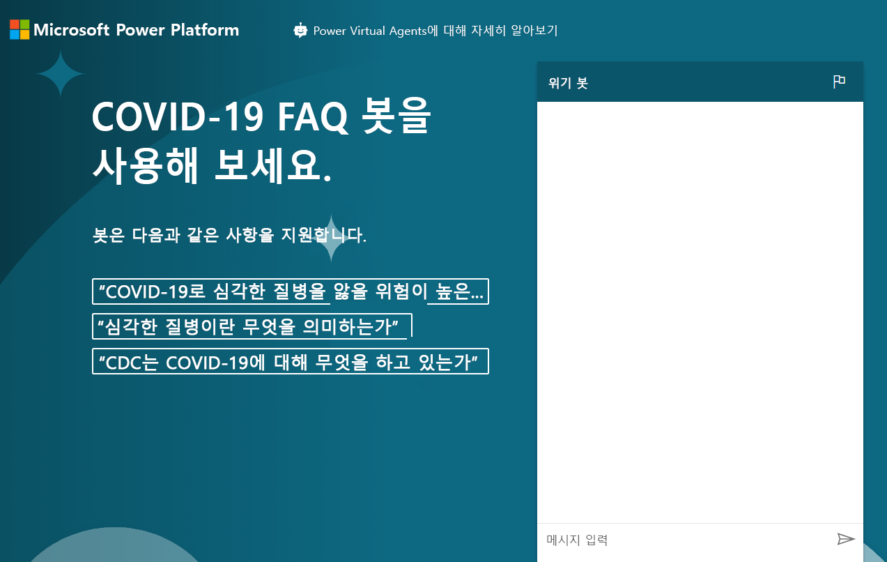

---
lab:
    title: '랩 8: 기본 챗봇을 빌드하는 방법'
    module: '모듈 6: Power Virtual Agents 소개'
---

# 모듈 6: Power Virtual Agents 소개
## 랩: 기본 챗봇 빌드하는 방법

# 시나리오

Bellows College는 캠퍼스 내에 여러 건물이 있는 교육 기관입니다. 캠퍼스 방문은 현재 종이에 기록되어 있습니다. 이 정보는 일관되게 수집되지 않으며, 전체 캠퍼스 방문 데이터를 수집하고 분석할 방법이 없습니다.

대부분의 조직과 마찬가지로 벨로즈 대학은는 COVID-19, 모범 사례, 일정 등에 대한 잘못된 정보로 인한 우려 사항에 신속하게 대응하고 있습니다. 이 랩에서는 전염병의 현재 상태에 대한 질문과 답변이 있는 질병 통제 센터 페이지를 가리키는 Power 가상 에이전트 챗봇을 빌드합니다. 벨로즈 대학교는 해당 설정을 통해 포털 사이트에 포함할 수 있을 뿐만 아니라 부서가 계획된 재개를 진행할 때 임시로 사용할 수 있도록 할 것입니다.

## 높은 수준의 단계

Power 가상 에이전트를 빌드하기 위해 아래 개요를 따를 것입니다.

  - Power Virtual Agent 평가판에 등록

  - FAQ를 사용하여 봇 빌드

  - 봇 테스트

  - 기본 인사말 변경

  - 봇 게시

  - **보너스 과제:** 포털에 봇을 포함

## 사전 요구 사항

프로젝트 완료를 위해 구현해야 하는 요구 사항은 다음과 같습니다.

  - **모듈 0 랩 0 - 랩 환경 검증** 완료

  - **모듈 2 랩 1 - Common Data Service 소개** 완료

  - 보너스 연습 문제만: **모듈 6 랩 4 - Power Apps 포털 소개** 완료 

## 시작하기 전에 고려해야 할 사항

봇은 다양한 시나리오에서 매우 유용할 수 있습니다. 벨로즈 대학에 대해 지금까지 알고 있는 내용을 기반으로 봇이 사용될 수 있는 조직의 다른 곳을 생각해 보세요.

# 연습 \#1: PVA 등록 및 새로운 봇 만들기

이 연습에서는 Power Virtual Agents 평가판에 등록합니다.

1.  [Power Virtual Agents](https://powerva.microsoft.com/)로 이동

2.  **무료 평가판 시작**을 클릭합니다. 

3.  필요한 경우 로그인합니다.

4. **새로운 봇 만들기** 창이 나타납니다.

5. **이름**에 **비상 봇**을 입력하고 언어를 선택합니다.   

6. 봇을 만들기 위한 연습 환경을 선택하고 **만들기**를 클릭합니다. 봇이 생성될 때까지 기다립니다.

7. 봇을 테스트합니다. 메시지 상자에 **안녕**을 입력하고 **보내기**를 클릭합니다. 봇은 인사를 하고 무엇을 할 수 있는지 알려줍니다.

8. **채팅을** 닫습니다. 

9. **토픽**을 선택합니다. 봇에는 샘플 사용자 토픽과 시스템 토픽 몇 가지가 함께 제공됩니다. 기본 인사말은 시스템 토픽에서 나옵니다.

10. 다음 연습에서는 CDC FAQ 사이트에서 고유한 토픽을 생성합니다. 이 브라우저 창에서 다른 곳으로 이동하지 마세요.

# 연습 \#2: 토픽 만들기

이 연습에서는 CDC FAQ 사이트에서 토픽을 생성합니다.

1.  새 탭에서 [CDC FAQ](https://www.cdc.gov/coronavirus/2019-ncov/faq.html) 사이트로 이동하여 사이트의 내용을 살펴봅니다. 이 FAQ에서 토픽을 생성하겠습니다.

2.  URL을 복사합니다.

3.  Power Virtual Agents로 돌아가서 여전히 **토픽**이 선택되어 있는지 확인합니다. 

4.  **토픽** 아래의 **추천** 탭을 선택합니다.

5.  **시작하기**를 클릭합니다.

6.  복사한 URL을 **온라인 콘텐츠 링크** 텍스트 박스에 붙여넣고 **추가**를 클릭합니다.

7.   **시작**을 클릭하고 기다립니다. 몇 분 정도 소요될 수 있습니다.

8.  몇 가지 추천 토픽이 만들어집니다.

9.  클릭하여 추천 토픽 중 하나를 엽니다.

10. 트리거 문구와 봇이 회신할 내용이 표시됩니다. **토픽에 추가를 클릭합니다.**
    
11. 토픽에 선택한 추천 토픽이 추가됩니다. 추천 토픽을 모두 선택하고 **토픽에 추가**를 클릭합니다(이름 열 왼쪽의 아이콘을 사용하여 모두 선택할 수 있습니다). 오류 메시지가 표시되는 경우 다시 시도합니다.

12. 추천 토픽 추가가 완료되면 **기존** 탭을 선택합니다. 상태가 꺼짐으로 설정되어 있는 새 토픽이 표시됩니다.

13. **상태** 열의 토글 단추를 클릭하여 모두 **켜짐**으로 설정합니다. 시간이 부족하다면 처음 10개만 켜도 되지만 "**마스크를 착용해야 할까요?**" 는 **켜짐**으로 설정해야 합니다.

14. 이 브라우저 창에서 다른 곳으로 이동하지 마세요.

# 연습 \#3: 토픽 테스트

이 작업에서는 추가한 토픽을 테스트합니다.

1.  **봇 테스트**를 클릭합니다.

2.  **다시 설정**을 클릭합니다.

3.  **마스크를 착용해야 할까요?** 라고 입력하고 **보내기**를 클릭합니다.

4.  봇은 올바른 정보를 제공하고 질문에 대한 답변이 충분했는지 묻습니다. **예**를 클릭합니다.

5.  봇이 답변에 대한 평가를 요청합니다. 훌륭하다고 평가하세요.

6.  봇이 다른 도울 것이 있는지 묻습니다. **아니오**를 클릭합니다.

7.  봇이 채팅 세션을 마칩니다.

8.  **안녕하세요**라고 입력하고 **보내기**를 클릭합니다.

9.  봇은 사용자에게 인사를 하고 자신이 할 수 있는 일을 안내합니다. 이제 봇이 COVID-19 FAQ를 사용하여 사용자에게 도움을 줄 수 있으므로 다음 작업에서 인사말 메시지를 변경해야 합니다. 이 브라우저 창에서 다른 곳으로 이동하지 마세요.

# 연습 \#4: 인사말 변경

이 작업에서는 인사말을 COVID-19에 맞추어 변경합니다.

1.  **토픽**을 선택했는지 확인하고 **기존** 탭을 선택합니다.

2.  **사용자 토픽** 섹션을 축소합니다.

3.  시스템 토픽의 **인사말** 토픽을 클릭하여 엽니다.

4.  인사말 토픽에는 52개의 트리거 구가 있습니다. **제작 캔버스로 이동**을 클릭합니다.

5.  첫 번째 메시지를 다음과 같이 변경합니다. **안녕하세요, 가상 에이전트입니다. COVID-19의 확산 방식, 자신을 보호하는 방법, 가정에서 COVID-19에 대비하는 방법, 증상, 테스트 등에 대해 알려 드릴 수 있습니다.**

6.  **저장**을 클릭합니다.

7.  봇이 이제 열려 있지 않은 경우 **테스트 봇**을 클릭합니다. **다시 설정**을 클릭하여 채팅을 다시 설정합니다.

8.  안녕하세요라고 입력하고 **보내기**를 클릭합니다.

9.  봇이 이제 새 인사말로 회신합니다.

# 연습 \#5: 봇 게시

이 연습에서는 봇을 게시합니다.

1.  왼쪽 탐색 모음에서 **게시**를 선택합니다.

2.  **게시**를 클릭합니다.

3.  **게시**를 다시 클릭하고 게시가 완료될 때까지 기다립니다.

4.  왼쪽 탐색 모음에서 **관리**를 펼치고 **채널**을 선택합니다.

5.  봇을 게시할 수 있는 채널 목록이 표시됩니다. **데모 웹 사이트**를 선택합니다.

6.  환영 메시지를 **COVID-19 FAQ 봇을 사용해 보세요.** 로 변경합니다.

7.  대화 시작 질문으로 “COVID-19에 걸렸을 때 심각한 증상을 겪을 고위험군은 누구인가요”, “더 심각한 증상의 의미는 무엇인가요”, “CDC는 COVID-19에 대해 어떤 대응을 하고 있나요”를 입력하고 **저장**을 클릭합니다.

8.  **URL**을 복사합니다.

9.  동료와 URL을 공유하고 피드백을 받을 수 있습니다. 새 브라우저 창 또는 탭을 시작하여 복사한 URL로 이동합니다. 아래 이미지와 같은 데모 웹 사이트가 표시됩니다.

10. 계속해서 봇과 채팅을 시작합니다.  
    
완료하면 게시한 봇이 다음과 같은 모습으로 표시됩니다.

# 과제 
* 벨로즈 대학 방문자 포털에 챗봇을 포함하세요(포함 방법에 대한 자세한 정보는 [여기](https://docs.microsoft.com/en-us/power-virtual-agents/publication-connect-bot-to-web-channels) **Power Apps에 챗봇 추가** 참조).
